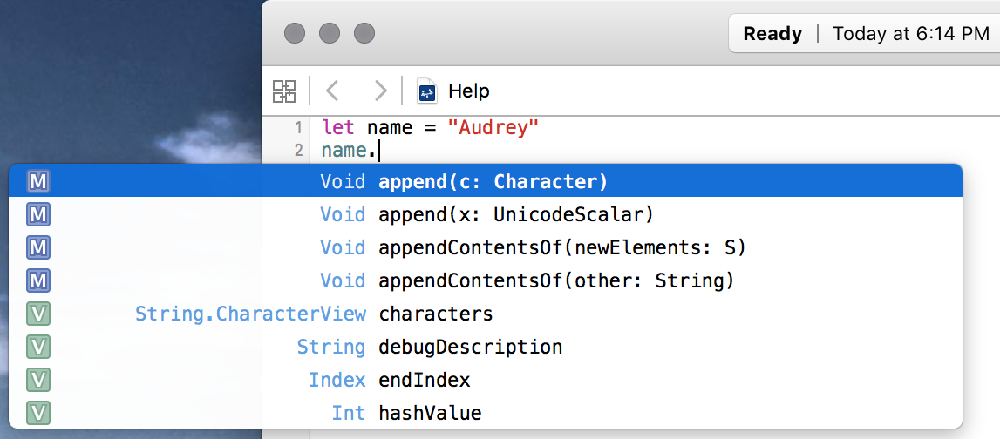
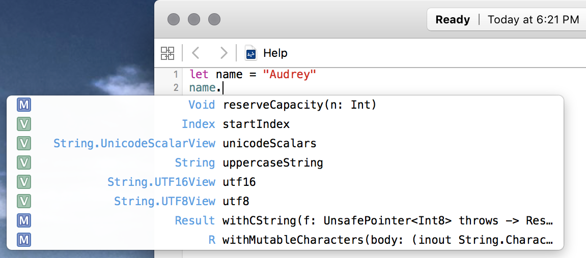
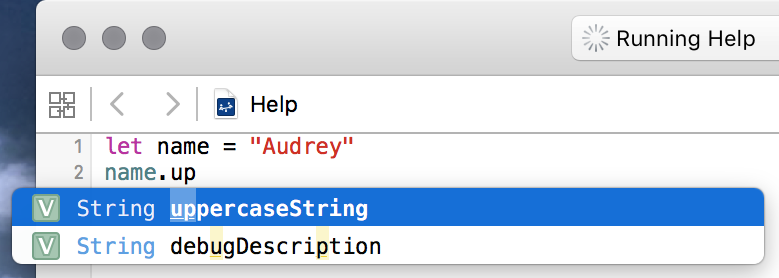
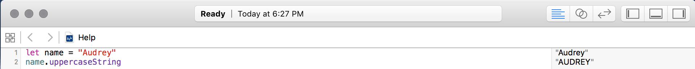

# Strings, Their Functions, and Documentation

  
> Nothing is impossible, the word itself says "I'm possible"!

## Learning Objectives - The student should be able to...

* Use Apple's documentation.
* Bring up Apple's documentation from the playground file.
* Understand how to produce the following:

```swift
let nameCapitalized = name.uppercaseString
let fullName = name + " Hepburn"
```

## What the student can do at this point 

* Create functions with one/two arguments
* Create functions with return values
* Create variables and constants
* Knows how to use the `print` function
* Knows of the types `String` and `Int`

## Getting Help

You've learned quite a bit about Swift in your lessons so far. You've learned about Swift's `print` function, the `String` and `Int` data types, and how to create your own functions. There's still a lot of things to learn, though. Luckily, Xcode helps you out a bit with this.

One of the biggest benefits of Xcode is the ability to get help when you need it. Apple ships quite a bit of useful documentation with Xcode that you can easily call up in order to learn more about the code you are writing. It even provides suggestions and helps fill in code in some situations. It's a very useful tool that you will learn a lot more about as you work with Swift...but for now, let's take a look at some of Xcode's basic help features.

To see Xcode's help features in action, first create a new playground file. Add this simple constant declaration to your playground:

```swift
let name = "Audrey"
```

`name` is now a `String` bound to the value "Audrey". Take a second to consider `String`s in Swift.

### Segue: We Need to Talk About Strings

You've seen that you can print `String`s to your playground's console using Swift's `print` function. Have you considered other things you may like to do with strings? You haven't seen anything else they can do, but think a bit about the sorts of things you'd expect a string of text to be able to do. Given a string, what are some things you may want to do with it?

* Capitalize it (make it consist only of capital letters)
* Turn every letter to lowercase
* Add it to the end of another string
* Make it blink and change colors

Okay, that last one is a bit outside the scope of this lesson, but the other things are pretty straightforward. At this point, you may be thinking, "Gee, I don't even know how to write code to do all of those things! Are they even possible?" Of course they're possible—and, in fact, Swift provides a way to do those things already!

Swift's built-in data types come with a set of behaviors, known as _methods_, that let you use and manipulate those data types in various common ways. Both `String` and `Int` have a set of methods that let you do things to those values. Of course, you have to be able to know what methods Swift provides out of the box! That's where Xcode's help functionality comes into play.

### Back to Xcode

Let's go back to your playground file and see this help documentation in action. Here's your goal: Capitalize your string "Audrey" so it becomes "AUDREY". Impossible? No way! Let's take this step-by-step so you can learn how to do this with the help of Xcode.

On a new line of your playground, type `name.`—make sure you type the period at the end! Then stop. You will see a popup with a list of methods that are available to `String`s appear like this:



This popup is referred to as "autocomplete". This menu appears in Xcode whenever you try to call a method on a constant or variable.

Remember, a _method_ is just a function that is attached to a particular data type. Methods are called like functions, except you put the constant or variable you are call on them _before_ the method name, followed by a dot, and then the name of the method. Arguments to the method are supplied the same way they are when you call functions: By placing them in parentheses after the method name. For now, just think of a method as a function. You'll learn a lot more about methods in a later lesson.

Take a look at the autocomplete menu that appeared. All of the items in it are methods that you can call on `String`s. And what you see right now is only some of them! Don't worry what all of them do right now. For now, you're only interested in one that capitalizes your "Audrey" string.

You can actually scroll this through this autocomplete popup. Use your mouse or trackpad to scroll through the list. Keep scrolling down until you get to the methods that start with **U**. You should see one that is called `uppercaseString`. That looks like a winner!



Now type `up`, so your line of code in your playground says `name.up`. You'll see that the autocomplete list is now filtered, so only methods that match the string "up" appear.



Make sure "uppercaseString" is highlighted in the autocomplete menu and hit <kbd>Return</kbd>. Xcode will helpfully fill in the rest of the method name. (You could also type it out yourself, but why not let Xcode do all the boring work?)

You've just called a method on your `String`! Notice in the playground sidebar that the return value of that method is "AUDREY". Your string has been capitalized!



You can see this in action by printing the value of `name.uppercaseString` to the playground's console. Try saving that return value in another constant and printing it out. Here's some code to help you that you can try out in your playground:

```swift
let uppercaseName = name.uppercaseString
print("\(name)... \(name)... \(uppercaseName)! WAKE UP!")
// prints "Audrey... Audrey... AUDREY! WAKE UP!")
```

## Getting More Help

The help documentation included with Xcode is very comprehensive. You should get used to browsing it, as it will become very important as you learn Swift.

You can bring up Xcode's full documentation suite by hitting <kbd>Command</kbd>+<kbd>Shift</kbd>+<kbd>0</kbd> (that last key is the zero key, not the letter O), or by selecting **Documentation and API Reference** from Xcode's **Window** menu. Here you will find all of Swift's documentation. You'll become very familiar with this documentation as you work through these lessons.

<a href='https://learn.co/lessons/Documentation' data-visibility='hidden'>View this lesson on Learn.co</a>
